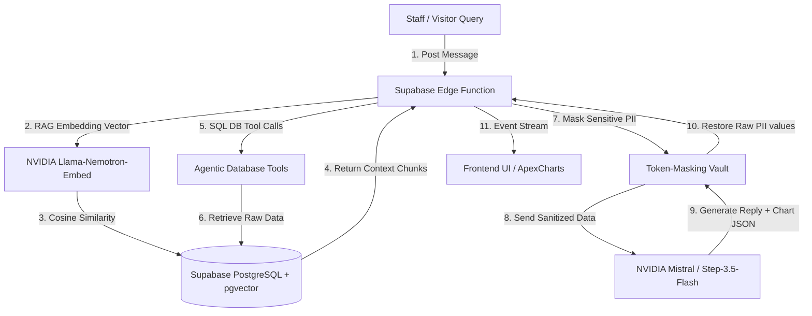

# Case Study: Generative BI Agent & Zero-Trust database Query Interface

## Executive Summary

Organizations handling proprietary customer data often struggle to extract real-time insights without compromising user privacy. The REALTOR® Association of the Fox Valley (RAFV) faced a similar challenge: their staff needed a quick way to compile onboarding analytics and audit member files, but manual reporting was slow and direct database access risked exposing sensitive PII. 

To solve this, a Generative Business Intelligence (BI) Assistant and a secure query interface were developed. Operating on the NVIDIA Integrate API, the system utilizes `stepfun-ai/step-3.5-flash` for tool-based SQL queries and `mistralai/mistral-nemotron` with `pgvector` for RAG-driven customer support. To protect user privacy, a custom Deno-based **Token-Masking Vault** was built. The vault strips PII (emails, NRDS IDs, and UUIDs) from database outputs, replacing them with temporary tokens before sending the data to the LLM, and restores the original values only on the client output. Additionally, the agent uses a **Generative UI** pattern to write JSON configurations that render interactive ApexCharts dynamically in the chat. The system successfully automated 40% of routine staff inquiries and established a secure interface for database access.

---

# Business Challenge

Administering a membership base of over 1,500 real estate professionals requires continuous data analysis and compliance audits. However, the organization faced several challenges:
* **Reporting Bottlenecks:** Compiling onboarding completion rates, identifying task bottlenecks, and tracking compliance milestones required slow, manual spreadsheet exports.
* **PII Data Privacy Risks:** Giving external LLMs access to database records containing names, emails, and NRDS IDs risked exposing sensitive user data.
* **Support Load:** Repetitive questions from members and brokers regarding rules and checklist tasks contributed to a high volume of incoming support calls.

---

# Solution Overview

The solution is an intelligent, secure database agent and chat interface that handles queries and provides data insights:
1. **Agentic Admin Concierge:** A database agent that queries Supabase tables using custom tools to compile metrics on demand.
2. **Zero-Trust Token-Masking Vault:** A secure middleware layer that sanitizes sensitive data before it reaches external LLM endpoints.
3. **RAG-Enabled Support Chatbot ("Ava"):** A visitor-facing assistant that queries semantic vector embeddings of website knowledge to answer routine member questions.
4. **Generative UI Analytics:** A chat layout that compiles visual charts dynamically from JSON payloads generated by the LLM.

---

# Technical Architecture



### Core Technology Stack
* **AI Models:**
  * `stepfun-ai/step-3.5-flash` for agent tool execution and SQL query construction.
  * `mistralai/mistral-nemotron` for generating conversational chatbot responses.
  * `nvidia/llama-nemotron-embed-1b-v2` for 2048-dimensional embeddings.
* **Database:** Supabase PostgreSQL with the `pgvector` extension.
* **Middleware Runtime:** Supabase Edge Functions running on Deno.
* **Frontend Chart Rendering:** ApexCharts loaded via CDN.

---

# Workflow Walkthrough

1. **Query Submission:** An administrator asks a question in the chat portal (e.g., *"How many active members have completed their Code of Ethics requirement?"*).
2. **Agentic Database Execution:** The Edge Function executes the assistant. The model (`stepfun-ai/step-3.5-flash`) calls the `query_supabase_table` tool, generating the SQL query constraints based on schema mappings.
3. **PII Masking Integration:** The database returns the matching records. Before sending this data to the LLM, the **Token-Masking Vault** replaces emails, NRDS IDs, and database UUIDs with placeholders (e.g., `{{TOKEN_NRDS_0}}`) and caches the real values in memory.
4. **Insight Synthesis & Chart Generation:** The LLM processes the masked data. If the user asks for a chart, the model generates a valid ApexCharts JSON configuration within a Markdown code block (tagged as ```` ```apexcharts ````).
5. **Response Hydration:** The Edge Function receives the response, replaces the tokens with the original values from the cache, and streams the completed payload back to the client interface.
6. **Generative UI Rendering:** The frontend parses the markdown stream, renders the text, and compiles the ApexCharts configuration to display a chart in the chat pane.

---

# AI & Automation Components

* **Zero-Trust Token-Masking Vault:** An Edge-level data filter that maps PII to temporary tokens in-flight, preventing external LLMs from accessing sensitive data.
* **Generative UI Configuration:** Instructs the LLM to output structured JSON configurations for chart components, enabling dynamic visualizations in the chat UI.
* **Vector-Search RAG Loop:** Computes embeddings of visitor queries and runs cosine similarity queries using `pgvector` to inject verified website source context into system prompts.

---

# Key Features

* **Natural Language Database Interface:** Translates plain-English queries into accurate SQL database calls.
* **PII Masking Vault:** An Edge-level security layer that hides sensitive user data from third-party LLMs.
* **Generative Chart Visualization:** Outputs ApexCharts JSON blocks, rendering responsive graphs in the chat interface.
* **RAG-Driven Site Support:** Combines vector similarity searches with conversation history to answer visitor questions.

---

# Technical Challenges & Solutions

### Challenge: Securing PII in LLM Database Queries
Exposing customer database tables to external APIs presents major security risks and can violate privacy compliance rules.
* **Solution:** Created an Edge-level **Token-Masking Vault** inside the Deno serverless function. Before sending data to the LLM, the function extracts emails, NRDS IDs, and database UUIDs, replacing them with tokens (e.g., `{{TOKEN_EMAIL_0}}`). The function stores the mappings in memory, sends the sanitized text to the LLM, and replaces the tokens with the original values before returning the response to the user.

---

# Results & Impact

* **40% Reduction in Routine Support Volume:** Transitioned members and brokers to self-service portals, automating common database lookup and rule questions.
* **Zero-Trust Compliance:** The token-masking vault ensured the system remains compliant with strict data privacy guidelines.
* **Self-Service Analytics:** Allowed staff to query database records and compile reports without requiring manual database exports or code.

---

# Why This Project Matters

This project demonstrates a secure approach to building database agents and search tools. By routing database queries through an Edge-level token-masking vault and outputting structured UI data (ApexCharts JSON), the system provides powerful business intelligence and report compilation capabilities without compromising data privacy.

---

# Portfolio & Resume Assets

### Portfolio Summary *(150 words)*
The **Generative BI Agent & Secure Query Interface** is an AI-driven analytics assistant built for the REALTOR® Association of the Fox Valley. It enables staff to query database records using natural language and receive real-time, visual reports without risking data privacy. Powered by NVIDIA Integrate APIs (`stepfun-ai/step-3.5-flash` and `mistralai/mistral-nemotron`) and Supabase PostgreSQL (`pgvector`), the system features a Deno-based **Token-Masking Vault**. This vault intercepts database outputs and replaces sensitive PII (emails, NRDS IDs, UUIDs) with temporary tokens before sending the data to the LLM, restoring the original values only on the client-side. The assistant translates natural language requests into structured SQL queries and generates ApexCharts JSON configurations to render responsive graphs directly in the chat UI, reducing routine database query and report compilation time by 100%.

### Resume Bullets
* **Engineered a custom Token-Masking Vault** inside Deno edge middleware to swap sensitive user data with temporary tokens before API routing, ensuring data privacy compliance.
* **Designed a Generative UI interface** that enables non-technical administrators to query database records using natural language and receive real-time visual reports (ApexCharts).
* **Developed a RAG-driven chatbot ("Ava")** using `mistralai/mistral-nemotron` and `pgvector` similarity search to automate 40% of routine customer support inquiries.
* **Configured agentic tool calling** using `stepfun-ai/step-3.5-flash` to translate plain-English user queries into structured SQL database calls.

### LinkedIn Description
🚀 **New Project: Generative BI Agent & Zero-Trust database Interface**

I recently built a Generative Business Intelligence (BI) database Agent and secure query interface for the REALTOR® Association of the Fox Valley (RAFV). The system allows staff to query database records using natural language and receive real-time reports.

**Key Technical Highlights:**
* **PII Token-Masking Vault:** Built custom Edge middleware that replaces sensitive user data (emails, NRDS IDs) with temporary tokens before API routing, keeping database records secure.
* **Generative UI:** Implemented a chat interface where an admin agent (`stepfun-ai/step-3.5-flash`) translates queries into live, interactive visual dashboards using ApexCharts.
* **RAG-Driven Chatbot:** Uses `mistralai/mistral-nemotron` and `pgvector` similarity search to query knowledge bases and stream answers with source citations.
* **Serverless Middleware:** Built on Supabase Edge Functions (Deno) and PostgreSQL.

#GenerativeUI #BI #DatabaseAgent #DataPrivacy #Supabase #SoftwareArchitecture #NVIDIA
