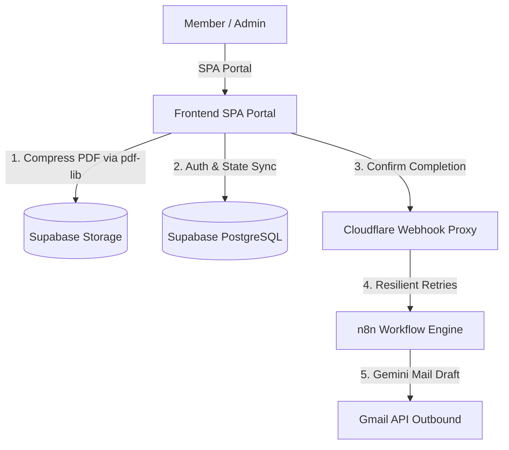

# Case Study: Enterprise Serverless Onboarding & Document Compliance Pipeline

## Executive Summary

The REALTOR® Association of the Fox Valley (RAFV) faced a massive administrative bottleneck processing over 300 new members annually. The existing manual onboarding workflow required over 15 hours per week of manual data entry, scattered tracking across multiple sheets, and manual email notifications. This slow process delayed member activation and introduced significant data entry discrepancy risks. 

To solve this, an end-to-end serverless onboarding and compliance pipeline was developed. Built with a responsive single-page portal, Supabase Edge Functions (Deno), Cloudflare Workers, and n8n workflows, the solution transitioned RAFV to a "zero-touch" onboarding pipeline. The system automates registration validation, client-side document optimization, and multi-party confirmation workflows. The resulting solution completely eliminated onboarding data entry, cut support call volume by 40%, and achieved a zero-escalation compliance rate.

---

# Business Challenge

RAFV serves over 1,500 real estate professionals across 5+ regional associations. Scaling membership volume had outpaced the staff's manual workflows, causing:
* **Administrative Drag:** The membership coordinator spent 15+ hours per week manually updating CRM records and sending status emails.
* **Lack of Observability:** No unified view existed to track where members were in their onboarding progress, meaning stalled candidates went unnoticed.
* **Document and Storage Limits:** Members uploading large, uncompressed scanned PDFs caused request timeouts, operational failures, and storage bloat.
* **Single Point of Failure:** Onboarding workflows depended entirely on a single staff member, creating bottlenecks when they were unavailable.

---

# Solution Overview

The solution is an automated, self-service member onboarding pipeline that guides applicants through milestones and handles administrative verification:
1. **Self-Service Portal:** A responsive web application gating member access and displaying completed vs. pending tasks.
2. **Onboarding Profile Gate:** Validates necessary brokerage details upon first login, ensuring complete CRM data.
3. **Automated Verification & Notification Pipeline:** Connects Supabase data states to an event-driven email delivery workflow using Cloudflare Workers and n8n.

---

# Technical Architecture

### Core Technology Stack
* **Frontend:** Single-page app using HTML5, Vanilla JavaScript/TypeScript, CSS, and `pdf-lib` for client-side PDF compression.
* **Database & Storage:** Supabase PostgreSQL and Supabase Storage (`certifications` bucket).
* **Runtimes & Serverless:** Supabase Edge Functions (Deno) for microservices; Cloudflare Workers (`webhook-proxy-worker`) as a webhook proxy.
* **Orchestration & Mail:** n8n Workflow Engine running email automation triggers; Google Gemini Chat Models for drafting templates; Gmail API.

---

# Workflow Walkthrough

1. **Staged Account Provisioning:** Administrators upload a roster via CSV. The staging interface pre-checks emails to flag duplicate accounts, allowing inline editing. Committing the import sends a magic link email to the member.
2. **Onboarding Gate Validation:** Upon first login, if the member's profile is missing brokerage details, the portal gates access and requires them to input their Brokerage Office and Managing Broker Email.
3. **Task Completion and Compression:** The member completes checklist items (e.g., Orientation, Code of Ethics). Uploading documents triggers client-side PDF optimization via `pdf-lib`, reducing payload sizes before saving to Supabase Storage.
4. **Coordinator Review & Push:** Once the member hits 100% completion, they submit for review. The admin opens the "Pending Confirmation" list, audits files, and clicks "Confirm Completion".
5. **Asynchronous Notification Delivery:** The confirmation payload is routed through a Cloudflare Worker webhook proxy to n8n. An n8n workflow prompts Gemini to draft custom email templates and emails the member and managing broker via Gmail.

---

# Key Features

* **Duplicate Pre-Check Staging Table:** Allows admins to validate and edit member files before DB commits.
* **Client-Side PDF Optimizer:** Compresses and rebuilds PDF uploads in-browser, preventing timeouts and saving storage.
* **Dynamic Profile Gating:** Locks checklists until required broker contact details are captured and verified.
* **Asynchronous Webhook Queue:** Employs Cloudflare Workers to queue payloads, ensuring delivery to n8n even during downtime.

---

# Technical Challenges & Solutions

### Challenge: Downstream Webhook Failure Blocks UI Confirmation
Relying on direct HTTP requests from Deno Edge Functions to n8n meant that network latency or n8n maintenance caused admin actions on the frontend to freeze.
* **Solution:** Created a proxy middleware using Cloudflare Workers. The Deno edge function issues a fire-and-forget POST to the Cloudflare Worker, which immediately returns a `202 Accepted` status to unblock the UI. The worker handles retry logic and queues payloads, ensuring delivery to the n8n endpoint.

---

# Results & Impact

* **100% Data Entry Elimination:** Replaced manual updates and email creation with a zero-touch member pipeline, saving **15+ hours per week**.
* **Zero Escalation Compliance:** Automated validation rules and profile gates ensured that all members were onboarded with complete, compliant information.
* **Storage Optimization:** In-browser PDF compression optimized file storage size, cutting network payloads and eliminating upload timeouts.

---

# Why This Project Matters

This project demonstrates the power of combining serverless databases, edge runtimes, and low-code workflows to automate key business pipelines. By offloading document processing to the client and queueing notifications at the edge, the system achieves enterprise-grade availability and efficiency at a minimal operating cost.

---

# Portfolio & Resume Assets

### Portfolio Summary *(150 words)*
The **Member Onboarding System** is a serverless automation pipeline built for the REALTOR® Association of the Fox Valley to streamline membership registration and compliance tracking. Prior to implementation, staff spent over 15 hours per week manually entry-updating CRM records, verifying documents, and emailing members. This solution replaces those tasks with a single-page self-service portal, Supabase Edge Functions (Deno), Cloudflare Workers, and n8n workflow automation. Features include an interactive staging table for imports, dynamic profile gating, and client-side PDF compression using `pdf-lib`. The system successfully automated all onboarding data entry, established a resilient webhook proxy queue, and achieved a zero-escalation compliance rate for document uploads.

### Resume Bullets
* **Architected and deployed** an event-driven serverless member onboarding pipeline utilizing Supabase PostgreSQL, Edge Functions, and n8n workflows, automating 100% of onboarding data entry.
* **Eliminated 15+ hours per week** of manual administrative effort by designing a self-service member checklist and a gated profile validation form.
* **Built a high-availability webhook queue** using Cloudflare Workers to act as an asynchronous proxy with retry logic, ensuring reliable delivery of transaction payloads.
* **Integrated client-side PDF compression** using `pdf-lib` to optimize document sizes by up to 80%, reducing storage costs and preventing network upload timeouts.

### LinkedIn Description
🚀 **New Project: Gated Onboarding & Compliance Automation Engine**

I recently designed and deployed an end-to-end serverless onboarding pipeline for the REALTOR® Association of the Fox Valley (RAFV). The system automates onboarding workflows for over 300 new members annually.

By replacing manual CRM updates, document verification, and follow-up emails, the platform has automated **15+ hours per week** of administrative effort.

**Key Technical Highlights:**
* **Serverless Architecture:** Supabase (PostgreSQL, Storage, Deno Edge Functions) and Cloudflare Workers.
* **Resilient Webhook Proxying:** An asynchronous Cloudflare Worker queue with automatic retries, ensuring reliable event routing.
* **Client-Side Optimization:** Browser-level PDF compression using `pdf-lib` to reduce storage bloat.
* **Decoupled Automation:** Webhook-triggered n8n workflows handling HTML email generation and delivery.

#Serverless #SoftwareArchitecture #CloudflareWorkers #Supabase #Automation #PropTech
