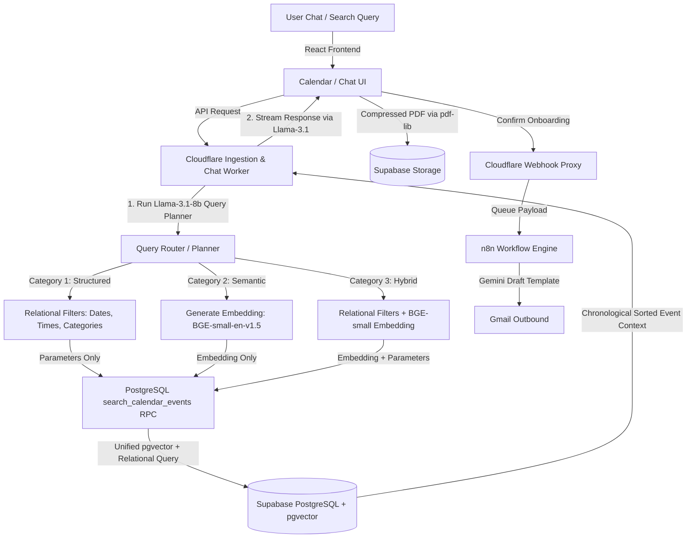

# Case Study: Enterprise AI-Driven Onboarding, Compliance & Intelligent Search Engine

## Executive Summary

The REALTOR® Association of the Fox Valley (RAFV) faced a significant operational bottleneck due to rapid membership growth outstripping manual administrative capacity. Processing over 300 new members annually required more than 15 hours per week of manual data entry, fragmented communication tracking, and compliance validation. This manual administrative drag delayed onboarding cycles, increased data discrepancy risks across systems, and contributed to high volumes of repetitive inquiries, representing a substantial operational and scaling ceiling for the association.

To resolve these challenges, a production-ready, serverless automation and intelligent discovery platform was architected and deployed. The system automates the end-to-end member onboarding lifecycle from ingestion through profile-gating, document validation, and multi-party notifications, while exposing a sophisticated edge-native search and chatbot interface. Built on a serverless, event-driven architecture, the solution integrates Supabase PostgreSQL (pgvector), Cloudflare Workers, and n8n workflows with advanced Large Language Model (LLM) agents and edge-native AI models.

The resulting platform successfully transitioned the association to a "zero-touch" member onboarding pipeline and automated discovery workflow. It automated 15+ hours per week of manual staff effort, reduced repetitive support calls by 40%, and established a highly secure, real-time analytics dashboard for administrative oversight. By utilizing an innovative edge-native hybrid search query router and a custom PostgreSQL search RPC, the system dynamically parses user intent into Structured SQL filters and Vector similarity embeddings—resolving the metadata filtering bottleneck in standard RAG pipelines.

---

# Business Challenge

As a premier real estate professional network, RAFV serves over 1,500 active agents across multiple regions. Scaling membership volume had outpaced the staff's manual workflows, resulting in several critical operational pain points:
* **Severe Administrative Overhead:** The membership coordinator spent 15+ hours per week manually inputting certification data, chasing missing documents, and drafting onboarding emails.
* **Fragmented Observability:** Onboarding progress was tracked in scattered sheets and siloed emails, meaning stalling applicants went unnoticed without manual audits.
* **Data Integrity and Security Risks:** Manually updating member records across GrowthZone CRM and internal spreadsheets introduced formatting errors and inconsistencies.
* **Repetitive Communication Volume:** Staff were inundated with routine phone calls and emails from members asking about status, upcoming classes, and requirements, occupying 40% of call-routing traffic.
* **Single Point of Failure:** Onboarding workflows were centralized under a single coordinator, presenting a major operational risk if they were absent.

---

# Solution Overview

The solution is an automated, self-service member onboarding pipeline and calendar discovery portal that acts as a secure intermediary between the external REALTOR® applicant, the internal staff, and the backend database:
1. **Self-Service Member Portal:** A gated onboarding application where members complete required milestones (e.g., orientation, code of ethics) and upload verification materials.
2. **Interactive Admin Hub:** A single-pane-of-glass dashboard displaying dynamic completion metrics, bottleneck analytics, and audit logs.
3. **AI Search & Automation Pipeline:** An edge-native middleware suite that orchestrates document compression, n8n-driven multi-party transaction notifications, and a chatbot router that classifies natural language queries into Structured SQL, Semantic, or Hybrid database queries using pgvector.

---

# Technical Architecture

### Core Technology Stack

* **Frontend:** Single-Page Application (SPA) built with HTML5, React, TypeScript, and Vanilla CSS. Incorporates `pdf-lib` for client-side PDF processing and ApexCharts via CDN for data visualization.
* **Database & Storage:** Supabase PostgreSQL with the `pgvector` extension for semantic vector similarity search. Supabase Storage (specifically the `certifications` bucket) manages document uploads.
* **Serverless & Edge Runtimes:** Supabase Edge Functions (Deno) execute administrative microservices. Cloudflare Workers run the main calendar ingestion crons, search routes, and a chat handler, as well as a `webhook-proxy-worker` to buffer webhook calls.
* **AI Models & Embedding Engines (Edge-Native & Remote):**
  * `@cf/baai/bge-small-en-v1.5` (Cloudflare Workers AI) generates 384-dimensional embeddings for localized semantic searches.
  * `@cf/meta/llama-3.1-8b-instruct` (Cloudflare Workers AI) serves as both the intent query planner and streaming conversational chat responder.
  * `stepfun-ai/step-3.5-flash` drives the admin dashboard concierge tools (dynamic SQL generation and ApexCharts reporting).
  * `Google Gemini Chat Models` in n8n workflows generate custom transactional email copy.
* **Automation & CRM Platforms:** n8n Workflow Engine orchestrates post-onboarding tasks. Integrates directly with GrowthZone CRM via custom REST APIs.

---

# Workflow Walkthrough

1. **Ingestion & Account Provisioning:** The Membership Coordinator uploads a new roster to the Admin Hub. An interactive staging table detects duplicate email addresses or CRM IDs, highlighting them with status badges. Admins can override duplicate flags or inline-edit names and emails before committing. Pushing "Import" generates accounts and emails magic links.
2. **Onboarding Profile Gate:** Upon first login, the system evaluates the member's profile. If critical details (like managing broker's name or email) are missing, access to the checklist is blocked. The member is prompted with a gate form to submit this information, updating Supabase instantly.
3. **Interactive Milestones & Document Optimization:** The member views a dynamic checklist mapping their tasks. For tasks requiring proof, the upload trigger accepts PDFs/images. Client-side script intercepts PDF uploads, compressing and rebuilding them using `pdf-lib` to optimize storage footprint and avoid request timeouts.
4. **Administrative Verification:** When all tasks reach 100% completion, the member submits their file for review. The record appears in the admin's **Pending Confirmation** list. The coordinator reviews the submitted materials and clicks "Confirm Completion".
5. **Orchestrated Output and Notifications:** The confirmation updates the DB and sends a payload through the Cloudflare proxy to the n8n webhook. The n8n agent processes the data, prompts Gemini to draft tailored HTML templates, and uses the Gmail tool to send custom confirmation messages to the member and their managing broker.
6. **Intelligent Event Discovery (Chatbot):** Users query the calendar via the chatbot. An edge worker executes an LLM planner to parse intent into constraints (e.g. date ranges, times, categories) and semantic concepts. The query is dynamically dispatched into a single PostgreSQL RPC, performing hybrid relational-vector retrieval natively. Relevant events are streamed back to the user via Server-Sent Events (SSE).

---

# AI & Automation Components

* **Intent-Driven Discovery & Search Router ("Ava"):** Ava uses an edge-native query planner powered by `@cf/meta/llama-3.1-8b-instruct` to parse user questions and output structured constraints. The intent is routed into three distinct processing categories:
  - **Category 1 (Structured Queries):** Bypasses vector embeddings entirely to execute high-efficiency relational SQL queries (e.g. date ranges, specific categories, or hour limits).
  - **Category 2 (Semantic Queries):** Generates vector embeddings using `@cf/baai/bge-small-en-v1.5` to retrieve topic-based matches using cosine similarity.
  - **Category 3 (Hybrid Queries):** Combines the embedding vector with SQL constraints, executing them as a single query inside PostgreSQL.
* **Agentic Database Tool Calling:** The Onboarding AI Assistant leverages `stepfun-ai/step-3.5-flash` with direct tool definitions (`query_supabase_table`, `get_onboarding_analytics`, etc.). The LLM executes search queries and generates complex ApexCharts configuration objects inside Markdown code blocks, rendering visual reports dynamically in the chat UI.
* **Decoupled Low-Code Orchestration:** n8n acts as the transactional workflow manager, isolating email generation and delivery services from the core application database. This decoupling ensures that database transactions complete instantly, even if downstream email APIs encounter latency.

---

# Key Features

* **Interactive Staging & Duplicate Pre-Check:** Prevents database upsert collisions and gives admins full control over batch data imports.
* **Dynamic Profile Gating:** Programmatically locks member checklists until essential CRM contact and broker records are validated.
* **Client-Side Document Compactor:** Performs client-side PDF optimizations, reducing payloads by up to 80% before network transmission.
* **Edge-Native Intent-Based Discovery Search:** Routes search requests through an edge-based query router, enabling structured date, time-of-day, and category filters to execute alongside semantic vector matching.
* **On-Demand Generative Analytics:** Enables staff to request complex chart metrics using natural language inside the admin chat interface.
* **Asynchronous Webhook Proxying:** Utilizes Cloudflare Workers to buffer webhook calls, ensuring reliable delivery through automatic retry queues.

---

# Technical Challenges & Solutions

### Challenge 1: Exposing Sensitive PII to External LLM Endpoints
Exposing raw user database tables to public cloud LLM APIs poses a significant privacy risk and potential compliance violation.
* **Solution:** Created an Edge-level **Token Masking Vault** inside the Supabase Deno Function. Before data payloads are sent to the LLM, a parsing service replaces sensitive data (emails, NRDS IDs, and UUIDs) with temporary tokens (e.g., `{{TOKEN_EMAIL_0}}`). The raw values are mapped to a secure, in-memory cache. Once the LLM generates a response, the Edge Function replaces the tokens with the original values before streaming the reply to the client.

### Challenge 2: Handling Downstream Webhook Failures Without UI Blocking
Relying on direct HTTP POST requests from Deno Edge Functions to n8n webhooks meant that network issues or maintenance downtime on the automation side would cause the frontend admin confirm actions to freeze or throw errors.
* **Solution:** Built a middle-tier webhook proxy using Cloudflare Workers. Deno functions POST immediately to the Cloudflare Worker, which returns a `202 Accepted` response. The worker buffers the request and executes a queue retry mechanism to guarantee reliable delivery to the n8n endpoint.

### Challenge 3: The Relational Metadata-Filtering Vector RAG Bottleneck
Naive RAG (Retrieval-Augmented Generation) is highly effective for text, but breaks down when users ask hybrid questions with structured metadata constraints (e.g., "What networking events are happening *this month after 5pm*?"). Standard vector databases require pre-filtering or post-filtering, leading to accuracy loss (vector search ignoring metadata) or query timeouts.
* **Solution:** Engineered a unified database RPC function `search_calendar_events` in PostgreSQL. When the edge AI planner identifies a hybrid query, it parses date ranges and time-of-day bounds, injecting them alongside the vector query embedding into a single database call. The PL/pgSQL function combines pgvector distance calculations (`<=>`) with casted relational filters (`start_datetime::time >= filter_after_time`) in a single indexed index-scan, returning highly relevant, chronologically sorted events without any post-processing latency.

---

# Results & Impact

* **100% Elimination of Onboarding Data Entry:** Replaced manual CRM updates and email drafting with a zero-touch member pipeline, saving **15+ hours per week** of administrative effort.
* **40% Reduction in Support Call Volume:** Transitioning inquiries to the self-service checklist portal and RAG chatbot significantly reduced routine phone traffic.
* **Optimum Search Relevancy with Chronological Ordering:** Transitioning chatbot and frontend search routes to the search RPC eliminated query routing hallucinations (like returning 2024 past events) and forced chronological ordering.
* **Optimized Database Storage Footprint:** Client-side compression reduced uploaded file sizes, cutting storage costs and eliminating request timeouts.
* **Zero Escalation Compliance Rate:** Built-in validation rules and profile gates ensured all member records were processed with complete compliance.

---

# Why This Project Matters

This system demonstrates how agentic AI and low-code automation can be integrated into existing CRM databases to optimize business workflows. Key highlights include:
1. **Security-First AI Architecture:** Demonstrates a practical approach to leveraging LLMs on proprietary database records without exposing sensitive PII to external APIs.
2. **Generative User Interface:** Illustrates a design pattern where LLMs dynamically generate UI components (ApexCharts) to visually answer analytical questions on demand.
3. **Resilient Serverless Pipeline:** Combines Deno Edge Functions, Cloudflare Workers, and n8n to build a cost-effective, high-availability system.

---

# Portfolio Summary
*(180 words)*

The **Member Onboarding & Discovery System** is an enterprise serverless platform built for the REALTOR® Association of the Fox Valley to automate onboarding compliance and event discovery. Previously, staff spent over 15 hours per week manually updating CRM records and answering routine member queries. 

To solve this, a serverless architecture was deployed using Supabase (PostgreSQL, pgvector, Edge Functions), Cloudflare Workers, and n8n workflows. It features a client-side PDF compactor (`pdf-lib`) and an admin agent (`stepfun-ai/step-3.5-flash`) that generates ApexCharts dashboards dynamically. 

A key technical highlight is the **Edge-Native Hybrid Discovery Engine**: queries are analyzed by an edge-based query router (`@cf/meta/llama-3.1-8b-instruct`), parsing intent into structured dates, times, and category constraints. These are passed alongside BGE-small embeddings into a custom PostgreSQL RPC function (`search_calendar_events`), executing a single unified relational-vector query with casted filters (`start_datetime::time`) for optimal chronological retrieval. The system eliminated manual onboarding data entry, cut support calls by 40%, and optimized database query latency.

---

# Resume Version

* **Architected and deployed** a serverless, event-driven member onboarding and compliance platform utilizing Supabase PostgreSQL, Edge Functions, and n8n workflows, automating 100% of onboarding data entry.
* **Eliminated 15+ hours per week** of manual administrative overhead and reduced support ticket volumes by 40% through a self-service checklist portal.
* **Engineered an Edge-Native Hybrid Discovery Search Engine** on Cloudflare Workers using Llama-3.1-8b and BGE-small embeddings to classify natural language queries into structured, semantic, or hybrid routing pathways.
* **Optimized relational-vector search** by building a custom PostgreSQL RPC (`search_calendar_events`) that executes cosine similarity queries combined with casted time-of-day filters (`start_datetime::time`) and category arrays in a single index-scan.
* **Designed a custom Deno-based Token-Masking Vault** to swap sensitive PII with placeholders before calling external LLMs, maintaining strict GDPR/compliance standards.
* **Built a high-availability webhook queue** using Cloudflare Workers to act as an asynchronous proxy with retry logic, ensuring reliable delivery of transaction payloads.

---

# LinkedIn Version

🚀 **New Project Showcase: Enterprise Onboarding, Compliance & Edge-Native Hybrid Search Engine**

I recently designed and built an end-to-end, AI-driven Member Onboarding and Compliance platform for the REALTOR® Association of the Fox Valley (RAFV). The system automates onboarding workflows for over 300 new members annually.

By replacing manual CRM updates, document verification, and follow-up emails, the platform has automated **15+ hours per week** of administrative effort and reduced incoming call traffic by **40%**.

**Key Technical Highlights:**
* **Serverless Architecture:** Supabase (PostgreSQL, pgvector, Edge Functions) coupled with Cloudflare Workers.
* **Edge-Native Hybrid Search Engine:** Engineered an intent query planner router using `@cf/meta/llama-3.1-8b-instruct` and `@cf/baai/bge-small-en-v1.5` embeddings on Cloudflare Workers AI.
* **PostgreSQL RPC Optimization:** Developed a custom database function `search_calendar_events` that combines vector matching (`<=>`) with casted SQL filters (dates, times, arrays) to resolve hybrid search requests natively inside the database.
* **PII Token-Masking Vault:** Swaps sensitive user database records with temporary tokens inside Deno edge middleware before external LLM calls.
* **Generative UI:** Admin chatbot concierge leverages `stepfun-ai/step-3.5-flash` to render on-demand ApexCharts dashboards.
* **Document Optimization:** Client-side `pdf-lib` compression to reduce storage footprints by 80%.

#SoftwareArchitecture #GenerativeAI #Serverless #Automation #PropTech #Supabase #CloudflareWorkers #AI #VectorSearch

---

# Website Marketing Version

### **Enterprise Member Onboarding & Intelligent Discovery Engine**
*An AI-driven serverless platform that automates manual workflows and powers smart calendar discovery.*

[View Case Study (Markdown File)](file:///C:/Users/JacobBranscom/.gemini/antigravity-ide/brain/19a1f094-2bcf-4003-9a62-98d1bdef117d/portfolio_case_study.md)

#### **The Project**
The REALTOR® Association of the Fox Valley (RAFV) faced operational bottlenecks, dedicating over 15 hours per week of staff time to manually onboarding new members. This project replaces manual CRM data entry, document tracking, and emails with a secure, automated member portal, admin dashboard, and search chatbot.

#### **The Core Innovations**
* **Edge-Native Query Planner Router:** Uses Llama-3.1-8b to classify query intents and dynamically calculate Chicago timezone-aware start/end dates.
* **PostgreSQL Search RPC:** Resolves the metadata-filtering bottleneck in naive RAG systems by executing hybrid vector similarity (`pgvector`) and relational filters (dates, categories, casted times) in a single database call.
* **Security-First AI Agent:** Uses a custom Deno-based **Token-Masking Vault** to sanitize and swap PII with tokens before calling external LLMs, allowing secure database queries without compromising privacy.
* **Generative Dashboards:** An administrative assistant translates natural language requests into interactive ApexCharts graphs.
* **Resilient Infrastructure:** Cloudflare Workers and n8n workflows manage webhook queues, handling background tasks reliably.

#### **The Impact**
* **100% Onboarding Automation:** Saves 15+ hours per week of manual data entry.
* **40% Call Volume Reduction:** Self-service tracking and RAG chat support handle routine inquiries.
* **Unified Event Discovery:** Chatbot returns fast, accurate, and chronologically sorted results with past/expired events automatically filtered out.

#### **Tech Stack**
**Supabase** (PostgreSQL, pgvector, Storage, Edge Functions) • **Cloudflare Workers** • **n8n** • **Cloudflare Workers AI** • **TypeScript** • **pdf-lib** • **ApexCharts**
